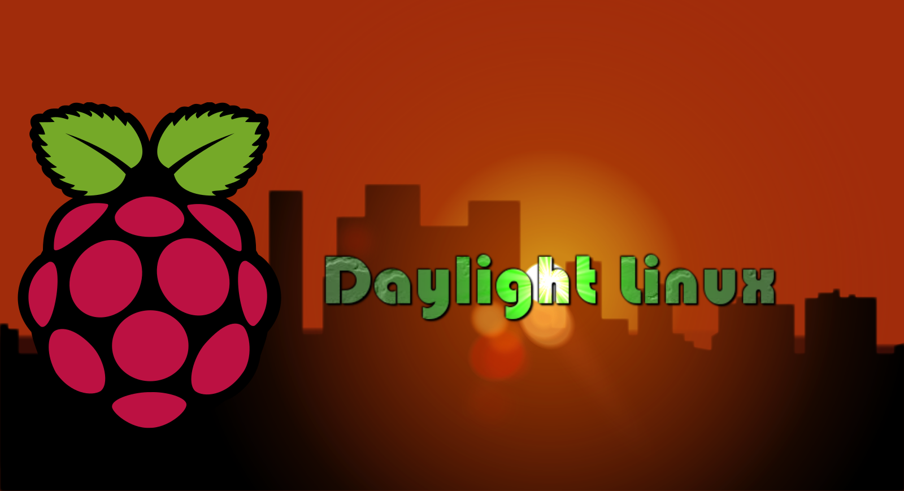
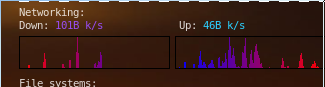

   

# Daylight Linux




Welcome to the git of Daylight Linux


## Homepage

http://daylightlinux.ch

## Download the Daylight linux Version 4 for Raspberry Pi
[](https://sourceforge.net/projects/daylight-linux/files/Daylight-GNU-Linux-RPI-Version4/Daylight-Linux-RPI-Version4.zip/download)


## Download the Daylight linux amd64 live version for computers
[

## Login

root : toor
daylight : toor

## How to prepare your micro SD card for the Raspberry Pi

You need at leat a 8 Go card for Daylight Linux. Some 8 Go cards have in reality 7.9 Go or under. The best is to use at least a 16 Go SD Card. Then expand the file system, from the terminal : #sudo raspi-config in the terminal then expand the file system (Advanced options > Expand file system). You can change the system and keyboard language from the raspi-config menu.

## Hot to flash the your micro SD card for the Raspberry Pi with Daylight Linux

```
sudo dd bs=1M of=/dev/mmcblk0 if=DaylightLinux201RPI.img status=progress  conv=fsync
```


## Try Daylight Linux Online 

Now you can test Daylight Linux directly in your internet browser at this address:

https://distrotest.net/Daylight%20Linux/V4

Be patient for the online operating system boot time.

## Last version 

The linux kernel is now upgraded to the 5.3 version for the AMD64 live version and Kernel 4.19.68 for the Raspberry Pi version.

All packages are upgraded to the Debian 10 version or to the cutting edge version (experimental) for all current softwares.

Added compatibility for the Raspberry Pi 4

The last version is the branch Version 4

For the last version :

```
git checkout Version4
```
## Connect to a wireless network

Right click on the desktop then : Internet > Communication > Network Manager 

## Change your network interface on conky


In your home folder modify the file .conkyrc just change all enp0s3 with your network interface name. To find your active network interface in the terminal the command is : ip a

```
Down:${color #8844ee} ${downspeed enp0s3} k/s${color lightgrey} ${offset 70}Up:${color #22ccff} ${upspeed enp0s3} k/s
${color black}${downspeedgraph enp0s3 32,150 ff0000 0000ff} $alignr${color black}${upspeedgraph enp0s3 32,150 0000ff ff0000}
```

## Change keyboard language

```
dpkg-reconfigure console-data
dpkg-reconfigure keyboard-configuration
service keyboard-setup restart
```
## Founder -  Developer

Hamdy Abou El Anein
