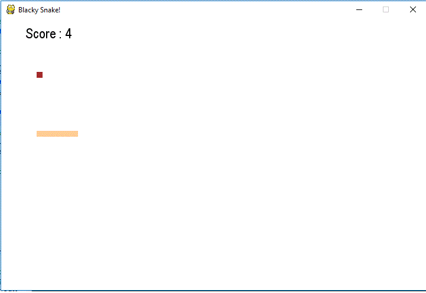

# Blacky Snake Game in Python 3

## What's this game ?

Snake is the common name for a video game concept where the player maneuvers a line which grows in length, with the line itself being a primary obstacle. The concept originated in the 1976 arcade game Blockade, and the ease of implementing Snake has led to hundreds of versions (some of which have the word snake or worm in the title) for many platforms. After a variant was preloaded on Nokia mobile phones in 1998, there was a resurgence of interest in the snake concept as it found a larger audience. There are over 300 Snake-like games for iOS alone.




## What you need to make it work :  

please install pygame


## How to play ?

```sh
python3 Blacky-Snake-Game.py
```  
Control the snake with the arrows of your keyboard.

## Developer - Author

Hamdy Abou El Anein

