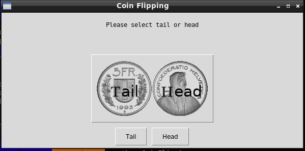

# Coin Flipping

## What's this game ?

Coin Flipping is the practice of throwing a coin in the air and checking which side is showing when it lands to choose between two alternatives, sometimes to resolve a dispute between two parties. It is a form of sortition which inherently has only two possible and equally likely outcomes.  





## What you need to make it work :

This game is made for Python 3.  

Install all the packages for : Python 3.  

easygui at least version 0.98  

```sh
sudo python3 -m pip install --upgrade easygui  
```  

## How to launch the game :

```sh
python3 CoinFlipping.py
```


## Developer - Author

Hamdy Abou El Anein

