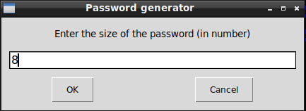
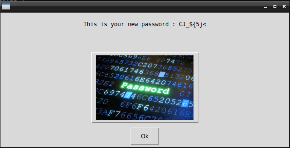

# Password Generator with GUI

## What's this software ?  

This software is writed in Python 3. The Password Generator fisrt ask you for the size of the password you need then create a random password.  

  





## What you need to make it work :

This game is made for Python 3.  

Install all the packages for : Python 3.  

easygui at least version 0.98  

```sh
sudo python3 -m pip install --upgrade easygui  
```  

## How to launch the Password Generator :

```sh
python3 PasswordGenerator.py
```


## Developer - Author

Hamdy Abou El Anein

