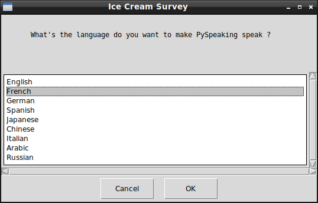

[](https://awesome.re)  

# PySpeaking-GUI

## What's this software ?  

This software use the google_speech api to read and then speak a sentence in the language that you select.   

    
    

## What you need to make it work :  

Install google_speech :  

https://pypi.python.org/pypi/google_speech/


This software is made for Python 3.  

Install all the packages for : Python 3.  

easygui at least version 0.98  

```sh
sudo python3 -m pip install --upgrade easygui  
```  


## How to launch this game :  

```sh
python3 speak.py
```  


## Developer - Author  

Hamdy Abou El Anein  

