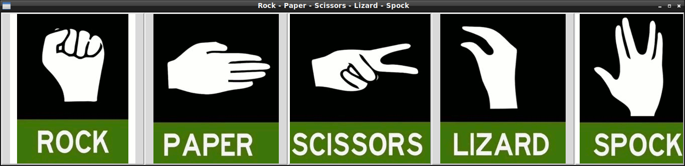
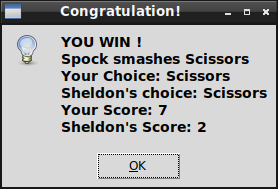

# Rock Paper Scissors Lizard Spock  


## What's this game ?  

Rock, Paper, Scissors, Lizard, Spock is a game of chance that expands. It is first used to settle a dispute about what to watch on TV between Sheldon and Raj in "The Lizard-Spock Expansion".  

It is mentioned again in "The Rothman Disintegration", where Sheldon explains the rules to Penny and Barry Kripke.  

The game was originally created by Sam Kass with Karen Bryla. According to an interview with Kass, the series producers did not originally ask for permission to use the game, but Kass was officially referenced by Sheldon as the creator of the game during the "The Rothman Disintegration", after which he states, "Hail Sam Kass!" to which Leonard, Howard, Raj, and Sheldon all then chant "Hail!" while raising their hands.  

sources for informations and rules: http://bigbangtheory.wikia.com/wiki/Rock_Paper_Scissors_Lizard_Spock

## Rules of the game  


The game is an expansion on the game Rock, Paper, Scissors. Each player picks a variable and reveals it at the same time. The winner is the one who defeats the others. In a tie, the process is repeated until a winner is found. Almost always, the boys will all pick Spock at the same time and tie over and over again.  

                    Scissors cuts Paper  

                    Paper covers Rock   

                    Rock crushes Lizard   

                    Lizard poisons Spock   
  
                    Spock smashes Scissors   

                    Scissors decapitates Lizard   

                    Lizard eats Paper   

                    Paper disproves Spock   

                    Spock vaporizes Rock   
 
                    (and as it always has) Rock crushes Scissors   


  



## What you need to make it work :  

This game is made for Python 3.  

Install all the packages for : Python 3.  

ImageTk  
```sh
sudo apt-get install python-pil.imagetk
```  

python3-tk (tkinter)
```sh
sudo apt-get install python3-tk
```  


## How to launch this software :  

```sh
python3 LizardSpock.py
```  


## Developer - Author  

Hamdy Abou El Anein  

