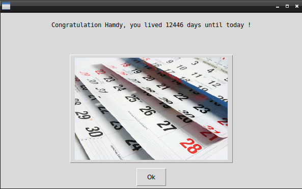

# How-many-days

## What's this software ?  

How many is writed in Python 3. It calculates for you how many days you lived. You have to enter your name and date birth.





## What you need to make it work :

This game is made for Python 3.  

Install all the packages for : Python 3.  

easygui at least version 0.98  

```sh
sudo python3 -m pip install --upgrade easygui  
```  

## How to launch the game :

```sh
python3 HowManyDays.py
```


## Developer - Author

Hamdy Abou El Anein

