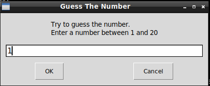

# Guess The Number

## What's this game ?  

Guess the number is writed in Python 3. You have to guess the number that your computer choose between 1 and 20.    
It will tell you if it's too big or too small untill you win.





## What you need to make it work :

This game is made for Python 3.  

Install all the packages for : Python 3.  

easygui at least version 0.98  

```sh
sudo python3 -m pip install --upgrade easygui  
```  

## How to launch the game :

```sh
python3 GuessTheNumber.py
```


## Developer - Author

Hamdy Abou El Anein

