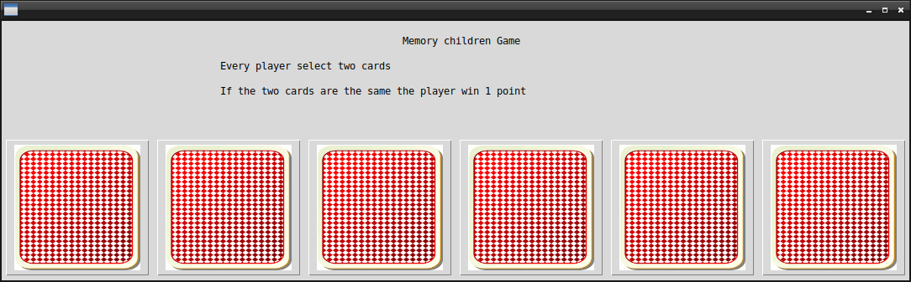

[](https://awesome.re)  


# Memory Children Game

## What's this game ?  

This is a memory game where every player click on two cards. If the two cards are the same the player win. The cards are randomly sorted at every launch of the game. 

  


## What you need to make it work :  

This game is made for Python 3.  

Install all the packages for : Python 3.  

easygui at least version 0.98  

```sh
sudo python3 -m pip install --upgrade easygui  
```  


## How to launch this game :  

```sh
python3 memory.py
```  


## Developer - Author  

Hamdy Abou El Anein  

