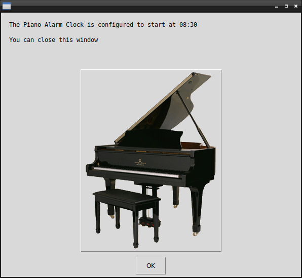

# Piano Alarm Clock

## What's this software ?  

This is a Piano Alarm Clock who play a radio piano stream at a defined clock time

## Sound stream informations 

1) The source stream is writed in sound.txt
2) The default piano radio stream is from the web radio ABC piano : abcpiano.radio.fr  
3) You can add some youtube video links to the sound.txt and the software will select it randomly


  


## What you need to make it work :  

This game is made for Python 3.  

Install all the packages for : Python 3.  

easygui at least version 0.98  

```sh
sudo python3 -m pip install --upgrade easygui  
```  


## How to launch this software :  

From windows launche the terminal as administrator

```sh
python3 alarmPiano.py
```  


## Developer - Author  

Hamdy Abou El Anein  

