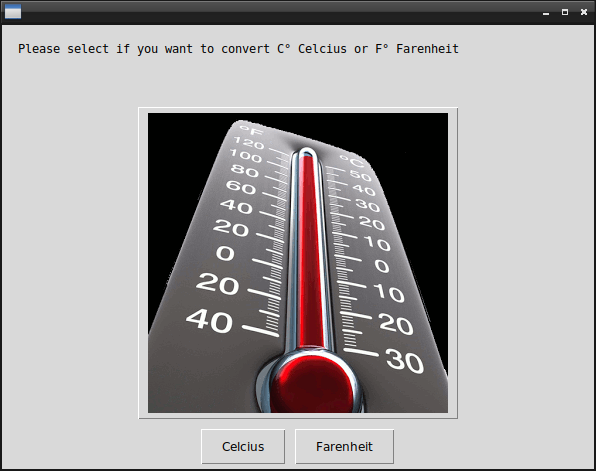
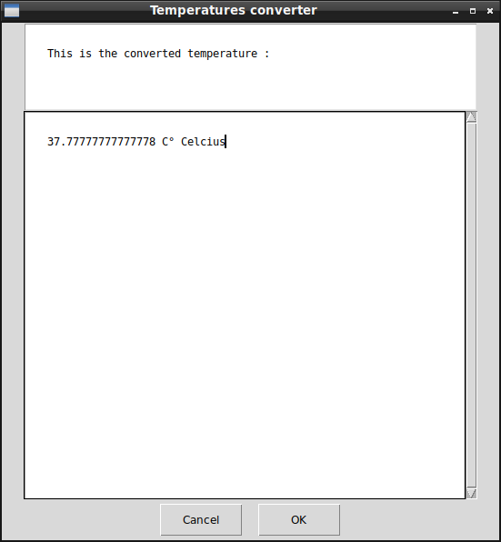

# Temperature Converter Celcius - Farenheit

## What's this software ?  

This software convert the temperature you enter in C° Celcius to F° Farenheit and F° Farenheit to C° Celcius  


  
 
 


## What you need to make it work :  

This game is made for Python 3.  

Install all the packages for : Python 3.  

easygui at least version 0.98  

```sh
sudo python3 -m pip install --upgrade easygui  
```  


## How to launch the software :  

```sh
python3 TempConverter.py
```  


## Developer - Author  

Hamdy Abou El Anein  

