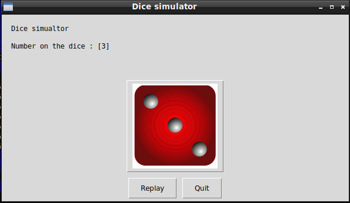

# Dice Simulator

## What's this game ?

Dice simulator select randomly the numbers on a 6 faces dice.  





## What you need to make it work :

This game is made for Python 3.  

Install all the packages for : Python 3.  

easygui at least version 0.98  

```sh
sudo python3 -m pip install --upgrade easygui  
```  

## How to launch the game :

```sh
python3 DiceSimulator.py
```


## Developer - Author

Hamdy Abou El Anein

