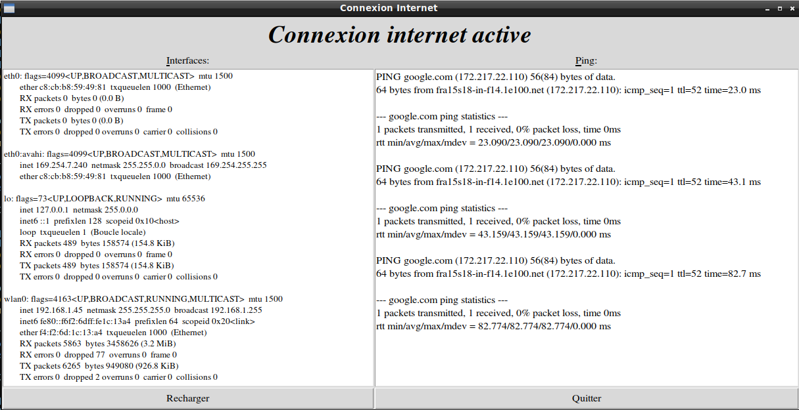

# Pyconnect

A Python3 software to test your internet connection  

  


## What you need to make it work :

This software is made for Python 3.  

Install all the packages for : Python 3.  

Install urllib :

with pip :  

```sh
pip install urllib3
```   
Alternatively, you can grab the latest source code from GitHub :  

```sh
git clone git://github.com/shazow/urllib3.git  
python setup.py install
```   
## How to launch Pyconnect :  

```sh
python3 pyconnect.py
```  

## Developer - Author

Hamdy Abou El Anein
